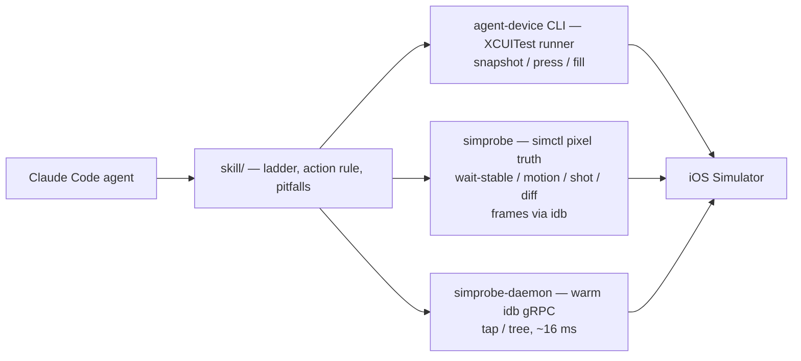

# MobileController

[](https://github.com/NicolasBataille/MobileController/actions/workflows/ci.yml)
[](https://github.com/NicolasBataille/MobileController/releases)
[](LICENSE)
[](skill/SKILL.md)

**Token-efficient tooling for driving an iOS Simulator from a Claude Code agent** — for iOS
developers who want an agent to exercise their SwiftUI app without burning the context window
on it.

## Why

An agent asked to "check that the sheet animates in and the email field accepts input" pays for
that check in *observation tokens*. Measured across seven existing tools, the same screen costs
between **78 and 96,873 tokens** to observe — a 1,240x spread — while latency varies only 3x
(0.36–1.4 s). Observation tokens, not latency, are the dominant cost.

So MobileController does not reimplement device automation. It adopts
[agent-device](https://github.com/callstackincubator/agent-device) (callstack, MIT) as the engine,
driven strictly as a CLI from Bash — never as an MCP server — and ships the three things it does
not: a skill encoding an observation ladder, `simprobe` for pixel truth, a warm daemon for loops.

| A 30-action session | Observation cost | Per action |
| --- | --- | --- |
| Best existing alternative | ≈ 18,400 tokens | `press` ≈ 1.0–1.5 s |
| This project's ladder | ≈ 4,200–9,900 tokens | `simprobe tap` **16 ms** through the daemon |

## How it works



- **Observe cheaply.** Start at the smallest rung that answers the question; escalate only when
  it cannot. A screenshot is the last rung, not the first.
- **Act fast.** `agent-device` for sessions, refs and text entry; the warm daemon when one screen
  is acted on dozens of times in a row.
- **Verify with pixels.** `simprobe` answers "did it move, and has it stopped?" with a number and
  zero images returned.

## Quick start

**Prerequisites:** macOS 14+, Xcode 26.6, an iOS 26.5 simulator, Node (for `agent-device`), and
optionally [idb](https://github.com/facebook/idb) for `frames` and the daemon.

**1. Install the automation engine.**

```sh
npm i -g agent-device@0.20.10          # or run it ad hoc: npx agent-device@0.20.10 <command>
```

**2. Install `simprobe`.** All three lines are required: the tap URL because the repository is
not named `homebrew-simprobe`, and `brew trust` because Homebrew 6 refuses to load a formula from
a third-party tap until you say so. Read [`Formula/simprobe.rb`](Formula/simprobe.rb) first — it
is under fifty lines and builds from the tagged source tarball.

```sh
brew tap NicolasBataille/MobileController https://github.com/NicolasBataille/MobileController
brew trust nicolasbataille/mobilecontroller
brew install simprobe
```

From source instead — `simprobe` alone has one dependency and a **58 s** clean build (2.7 MB);
adding `simprobe-daemon` pulls in 22 transitive packages, **347 s** for both in release (38.5 MB):

```sh
git clone https://github.com/NicolasBataille/MobileController && cd MobileController
swift build -c release --product simprobe   # the CLI alone
swift build -c release                      # adds simprobe-daemon and its gRPC stack
```

Keep the two binaries together: `tap` and `tree` look for `simprobe-daemon` beside the running
`simprobe`, never on `PATH`.


**3. Install the skill.** Copy the whole directory — the reference files are loaded by relative
path, so a copy of `SKILL.md` alone is broken.

```sh
mkdir -p ~/.claude/skills && cp -r skill ~/.claude/skills/mobilecontroller
```

**4. A first session.**

```sh
UDID=$(simprobe devices --booted --platform ios --json | python3 -c 'import json,sys;print(json.load(sys.stdin)[0]["udid"])')
agent-device --platform ios --udid "$UDID" --session mc open com.apple.Preferences
agent-device --platform ios --udid "$UDID" --session mc snapshot -i
agent-device --platform ios --udid "$UDID" --session mc press text=General   # localised row
simprobe wait-stable --udid "$UDID" --timeout 6s
simprobe shot --udid "$UDID" --out /tmp/settings.jpg
```

`--session` on every call is not optional: without it the session name is a hash of the current
directory, so two shells silently drive two sessions on one device.

## What's in the box

### `skill/` — the conventions, so the agent does not rediscover them

[`SKILL.md`](skill/SKILL.md) is always resident; three reference files load on demand
([agent-device cheatsheet](skill/references/agent-device-cheatsheet.md),
[pitfalls](skill/references/pitfalls.md), [simprobe](skill/references/simprobe.md)). Its core is
the escalation ladder:

1. `agent-device snapshot -i --level digest --json` — refs and labels of interactive elements.
2. `agent-device snapshot -i` — when the digest has no ref matching the target.
3. `agent-device snapshot` — structure questions: nesting, containers, non-interactive text.
4. `simprobe frames --interactive` — **where** something is; no snapshot rung carries coordinates.
5. `simprobe shot` — rendering questions no tree can answer, at ~470–510 vision tokens.

### `simprobe` — eight verbs and a warm daemon, no session, no private APIs

Every verb has a compact human-readable default, a `--json` form, and an exit code a shell can
branch on. Six need nothing but `xcrun simctl`; `frames` needs `idb`, and `tap`/`tree` need a
warm daemon. Full reference: [`skill/references/simprobe.md`](skill/references/simprobe.md).

| Verb | What | Cost |
| --- | --- | --- |
| `wait-stable` | Poll until three consecutive frames agree within `--tol` | 4 captures, 1.5–4 s |
| `motion <ms>` | A diff timeline over a window, **zero image bytes on stdout** | one line |
| `shot` | One JPEG at 1x logical points, so coordinates map 1:1 onto AX frames | ~470–510 vision tokens |
| `frames` | On-screen elements with their 1x coordinates (needs `idb`) | ~1.3 KB, 0.6–1.5 s |
| `devices` | Simulators, booted first, with the UDID `agent-device --udid` wants | one line each |
| `diff <a> <b>` | Two image files on the same scale the live verbs use | exit 4 when different |
| `daemon start\|stop\|status` | A warm idb gRPC connection, one process per UDID | 1.56 s cold start |
| `tap <#id \| @index \| x,y>` | Tap through the daemon, `--wait-stable` to verify it landed | **16 ms** |
| `tree` | `frames`' output from the warm path | **82 ms**, 1.9 KB |

### The warm daemon — for loops, not single steps

`simprobe-daemon` is a **second product** on purpose: gRPC brings 22 transitive packages, and
`swift build --product simprobe` never compiles any of them. Start it when one screen is observed
and acted on many times in a row — a mixed loop measured **2.7x** faster end to end than pure
agent-device, with an XCUITest session live on the same simulator. It is not a replacement: no
session, no `fill`, a leaner tree, a hard dependency on `idb_companion`.
[Design](docs/plans/05-warm-daemon.md).

> **Never compare node counts across engines.** idb's tree is leaner by design than XCUITest's.
> Diffing the two counts, or using either to prove an element is *absent*, produces confident
> nonsense.

### `bench/` and `DemoApp/`

[`bench/`](bench/README.md) runs a fixed observe→act→verify flow and records wall time, stdout
bytes, estimated tokens, host loadavg and an independent `simctl` control probe per step, so a
number survives being read on another machine. [`DemoApp/`](DemoApp/README.md) is its public
SwiftUI target: tabs, a 40-row list, a fill/read-back/clear form, and exactly one 300 ms
`easeInOut` transition to measure against.

## Measured

One representative repeat from the Settings and daemon runs, on an 8-core Apple Silicon Mac,
Xcode 26.6, iPhone 17 Pro / iOS 26.5, **agent-device `0.20.11-mc.1`**.

| Step | stdout | wall |
| --- | ---: | ---: |
| `agent-device --level digest --json snapshot -i` | 1515 B | 276 ms |
| `agent-device snapshot -i` | 851 B | 274 ms |
| `agent-device snapshot` (full tree) | 3152 B | 271 ms |
| `agent-device press text=…` | 33 B | 839 ms |
| `agent-device press text=… --settle` | 1491 B | 3198 ms |
| `simprobe shot` | 164 B + a 47 KB file ≈ 468 vision tokens | 469 ms |
| `simprobe tap` (daemon) | — | 16 ms |
| `simprobe tree` (daemon) | 1.9 KB | 82 ms |
| 20x (tap + tree), daemon vs `press` + `snapshot -i` | — | 2.05 s vs ~26–40 s |

**Read ratios, not absolutes:** wall time inflates 2–10x when host load rises above roughly twice
the core count, which is why every bench row carries `loadavg_1m` and a control probe.
**The digest rung is not the cheap rung on this build** — 1515 B against 851 B for `snapshot -i`,
where 0.20.10 read 447 B. Measure it on your own screen before assuming rung 1 is cheaper.

Full tables, load conditions and per-row analysis: [`docs/benchmarks.md`](docs/benchmarks.md).

## Compatibility

Tested only on this triple. When it drifts, re-run `bench/run.sh` before trusting any number here.

| Component | Version |
| --- | --- |
| agent-device | 0.20.10 |
| Xcode | 26.6 |
| iOS Simulator runtime | 26.5 |

`simprobe` needs macOS 14+, a Swift 6.0+ toolchain and nothing but `xcrun simctl` — except
`frames`, `tap` and `tree`: `brew install facebook/fb/idb-companion && pip3 install fb-idb`.

**agent-device version policy.** 0.20.10 stays pinned: the skill, the cheatsheet and the pitfalls
are written against it. Fixes for four of the five known limitations were merged upstream on
2026-08-27 (PRs #2065–#2068) but ship in no released version yet, so an interim patched build
(`0.20.11-mc.1`) is documented in [`docs/upstream.md`](docs/upstream.md) with the limitations.

## Design principles

- **No private APIs.** No `dlopen`, no `AXPTranslator`, no `SimulatorKit`, no Python, no
  codesigning story. CI greps for them and fails the build.
- **CLI, never MCP.** An MCP server costs 3k–66k tokens of tool schemas on every sampling; a CLI
  invoked from Bash costs zero standing tokens.
- **Token budget first.** Output is measured in hundreds of bytes, and every observation form is
  benchmarked against the alternatives rather than asserted to be cheap.
- **Pixel truth, not AX quiescence.** A tree goes quiet while implicit SwiftUI animations,
  crossfades and Canvas views are still moving. Rendering questions get a rendering answer.
- **Public-repo hygiene as a gate.** No absolute home paths, no simulator UDIDs, no private bundle
  identifiers, no committed screenshots; `scripts/hygiene-check.sh` enforces it in CI.

## Roadmap

- Batched press sequences: `batch` already accepts `press`/`fill` given the right step shape.
- Pluggable backends behind the skill's vocabulary.
- Unpin agent-device once a release ships PRs #2065–#2068.

## Contributing

See [CONTRIBUTING.md](CONTRIBUTING.md). Every change ships with a test that failed before it; the
gates are `swift test --enable-code-coverage` (80 % floor on `Sources/`), `swift format lint
--recursive Sources Tests`, and `./scripts/hygiene-check.sh`.

## Documentation

| | |
| --- | --- |
| [PRD](docs/plans/01-prd.md) | Problem, goals, measured baseline, acceptance targets |
| [Architecture](docs/plans/02-architecture.md) | Repo layout, module split, CLI surface, exit codes |
| [Task list](docs/plans/03-task-list.md) | Phased tasks with their TDD red steps |
| [Warm daemon spike](docs/plans/04-warm-daemon-spike.md) | Feasibility, latency, the coexistence test |
| [Warm daemon design](docs/plans/05-warm-daemon.md) | Why a second product, the wire protocol, the build budget |
| [Benchmarks](docs/benchmarks.md) | The full measured tables and how to regenerate them |
| [Upstream notes](docs/upstream.md) | Known agent-device limitations and the patched build |
| [The skill](skill/SKILL.md) · [bench/](bench/README.md) · [DemoApp/](DemoApp/README.md) | What the agent reads, the harness, its target |
| [CHANGELOG.md](CHANGELOG.md) | Release history |

## Credits

- [agent-device](https://github.com/callstackincubator/agent-device) by callstack (MIT) — the
  automation engine. MobileController is a complement to it, not a fork of it.
- [idb](https://github.com/facebook/idb) by Meta — the accessibility and HID path behind
  `frames`, `tap` and `tree`; its protos are MIT and the stubs are generated from the installed
  client's own descriptor.
- [grpc-swift](https://github.com/grpc/grpc-swift) — the daemon's transport.

## Licence

MIT — see [LICENSE](LICENSE).
